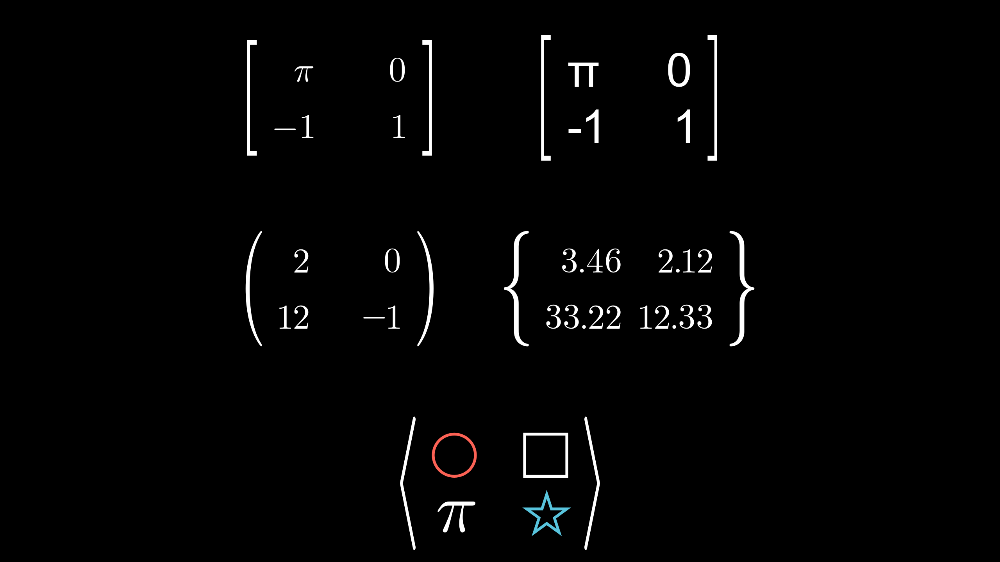

Manim utilities
======================

In this chapter we will learn some methods and classes that are quite useful to make our animations, here we will conclude all the **class animations**.

Helpful methods
------------------

``.interpolate_color``
""""""""""""""""""""""""""""""

As its name implies, it gives you an interpolation between two colors, you can see the `official documentation <https://docs.manim.community/en/stable/reference/manim.utils.color.html?highlight=interpolate_color#manim.utils.color.interpolate_color>`__ to see its definition and the algorithm, You can see in the same documentation other functions related to color in case you want to learn more.

.. code-block:: python

    def construct(self):
        dots = VGroup(*[Dot() for _ in range(3)])\
            .set(width=3).arrange(RIGHT,buff=1)

        left_dot, center_dot, right_dot = dots

        color1 = "#FF0000"; color2 = "#0000FF"
        color3 = interpolate_color(color1,color2,0.5)
        #                                         |
        #                                         v
        #                                  0 <= alpha <= 1
        #                               color1         color2

        print([color1,color2,color3])
        # ['#FF0000' '#0000FF' <Color #7f007f>]

        left_dot.set_color(color1)
        right_dot.set_color(color2)
        center_dot.set_color(color3)

        self.add(dots)

.. raw:: html

   

   
 Show result 

.. image:: ../_static/images/mu1.png

.. raw:: html

   

    

``.set_points``
""""""""""""""""""""""""""""""

.. note::

    For this section we are going to use the **grid** that you created in previous chapters, and it will help us to understand this method.

``_as_corners``
++++++++++++++++++

The way to make a polyline using the coordinates of the screen we can do the following:

.. code-block:: python

    def construct(self):
        sg = ScreenGrid() # Here is your Grid
        sg.fade(0.5)

        def coord(x,y):
            return np.array([x,y,0])

        points = [
            coord(x,y)
            for x,y in [
                (-6,3),
                (-1.5,-1),
                (0,0),
                (2,-3),
                (3.5,2)
            ]
        ]

        dots = VGroup(*[Dot(p) for p in points])
        polyline = VMobject(color=BLUE).set_points_as_corners(points)

        self.add(sg,polyline,dots)

.. raw:: html

   

   
 Show result 

.. image:: ../_static/images/mu4.png

.. raw:: html

   

    

``_smoothly``
++++++++++++++++++

.. code-block:: python

    def construct(self):
        sg = ScreenGrid() # Here is your Grid
        sg.fade(0.5)

        def coord(x,y):
            return np.array([x,y,0])

        points = [
            coord(x,y)
            for x,y in [
                (-6,3),
                (-1.5,-1),
                (0,0),
                (2,-3),
                (3.5,2)
            ]
        ]

        dots = VGroup(*[Dot(p) for p in points])
        polyline = VMobject(color=BLUE).set_points_smoothly(points)

        self.add(sg,polyline,dots)

.. raw:: html

   

   
 Show result 

.. raw:: html

   

    

``.point_from_proportion``
""""""""""""""""""""""""""""""

This is an exclusive method for VMobjects, especially for paths (lines and curves).

Think VMobject (a curve) as a **road**, as you travel the road you can tell the **percentage** you have completed. Using this analogy with curves (paths) you can locate a point in a percentage of the path using ``point_from_proportion``.

.. code-block:: python

    def construct(self):
        path = Line(LEFT,RIGHT)  # We will study this below.
        path.width = config.frame_width - 2

        proportions = np.arange(0,1.1,0.1)
                    # 0.1, 0.2, 0.3 ... 1.0

        prop_text = VGroup(*[
            VGroup(
                # The first argument to dot is the
                # coordinate where it is located,
                # so we don't need to use ".move_to"
                # in this case.
                Dot(path.point_from_proportion(p)),
                Text("%.1f"%p,height=0.3).next_to(path.point_from_proportion(p),DOWN),
            ).set_color(interpolate_color(RED,BLUE,p))
            for p in proportions
        ])

        start = Text("Start").next_to(path.get_start(),UP)
        end   = Text("End").next_to(path.get_end(),UP)

        self.add(path,prop_text,start,end)

.. raw:: html

   

   
 Show result 

.. image:: ../_static/images/mu2.png

.. raw:: html

   

    

With regular figures it is easy to see what this method means.

.. code-block:: python

    def construct(self):
        paths = VGroup(
            Line(LEFT,RIGHT), # We will study this below.
            Square(),
            Circle()
        ).arrange(RIGHT,buff=0.5)\
            .set(width=config.frame_width-2)

        def get_proportions(path,proportions=np.arange(0,1.1,0.1)):
            return VGroup(*[
                Dot(
                    # The first argument to dot is the
                    # coordinate where it is located,
                    # so we don't need to use ".move_to"
                    # in this case.
                    path.point_from_proportion(p),
                    fill_opacity=1-p+0.3,
                    color=interpolate_color(RED,BLUE,p)
                )
                for p in proportions
            ])
        
        def get_start_and_end(path):
            return VGroup(
                Text("START").next_to(path.get_start(),UP),
                Text("END").next_to(path.get_end(),DOWN),
            )
        
        vgrp_proportions = VGroup(*[
            get_proportions(path)
            for path in paths
        ])
        vgrp_start_end = VGroup(*[
            get_start_and_end(path)
            for path in paths
        ])

        self.add(paths,vgrp_proportions,vgrp_start_end)

.. raw:: html

   

   
 Show result 

.. raw:: html

   

    

This counts for any VMobject.

.. code-block:: python

    def construct(self):
        sg = ScreenGrid() # Here is your Grid
        sg.fade(0.5)

        proportions = np.arange(0,1.1,0.1)
                    # 0.1, 0.2, 0.3 ... 1.0

        def coord(x,y):
            return np.array([x,y,0])

        points = [
            coord(x,y)
            for x,y in [
                (-6,3),
                (-1.5,-1),
                (0,0),
                (2,-3),
                (3.5,2)
            ]
        ]

        polyline = VMobject(color=BLUE).set_points_smoothly(points)

        prop_text = VGroup(*[
            VGroup(
                # The first argument to dot is the
                # coordinate where it is located,
                # so we don't need to use ".move_to"
                # in this case.
                Dot(polyline.point_from_proportion(p)),
                Text("%.1f"%p,height=0.3)
                    .next_to(polyline.point_from_proportion(p),DOWN),
            ).set_color(interpolate_color(RED,BLUE,p))
            for p in proportions
        ])

        start = Text("Start").next_to(polyline.get_start(),UP)
        end   = Text("End").next_to(polyline.get_end(),UP)

.. raw:: html

   

   
 Show result 

.. image:: ../_static/images/mu6.png

.. raw:: html

   

    

``.get_subcurve``
""""""""""""""""""""""

Using the concept of ``point_from_proportion``, we can get a part of a VMobject by specifying the starting and ending percentage:

.. code-block:: python

    def construct(self):
        def coord(x,y):
            return np.array([x,y,0])

        points = [
            coord(x,y)
            for x,y in [
                (-6,3),
                (-1.5,-1),
                (0,0),
                (2,-3),
                (3.5,2)
            ]
        ]

        path = VMobject(color=BLUE).set_points_smoothly(points)
        partial_path = path.get_subcurve(0.1,0.9)
        partial_path.set_style(stroke_width=10,stroke_color=RED)

        self.add(path,partial_path)

.. raw:: html

   

   
 Show result 

.. raw:: html

   

    

``.set_color_by_tex``
""""""""""""""""""""""""""""""

In the Tex section we saw that there is an argument that allows us to color certain text, but sometimes we need to color certain parts afterwards, for this we use this method. However, to achieve this effectively we have to isolate the text as we saw it in ``TransformMatchingTex``.

.. code-block:: python

    def construct(self):
        equation = MathTex(
            r"e^x = x^0 + x^1 + \frac{1}{2} x^2 + \frac{1}{6} x^3 + \cdots + \frac{1}{n!} x^n + \cdots",
        )
        # FAIL
        equation.set_color_by_tex("+", YELLOW)
        equation.set_color_by_tex("x", BLUE)
        equation.width = config.frame_width - 1
        self.add(equation)

.. raw:: html

   

   
 Show result 

.. image:: ../_static/images/mu7.png

.. raw:: html

   

    

Succesull coloring:

.. code-block:: python

    def construct(self):
        equation = MathTex(
            r"e^x = x^0 + x^1 + \frac{1}{2} x^2 + \frac{1}{6} x^3 + \cdots + \frac{1}{n!} x^n + \cdots",
            substrings_to_isolate=["x","+"]
        )
        equation.set_color_by_tex("+", YELLOW)
        equation.set_color_by_tex("x", BLUE)
        equation.width = config.frame_width - 1
        self.add(equation)

.. raw:: html

   

   
 Show result 

.. raw:: html

   

    

We could have done this using ``tex_to_color_map`` in ``MathTex`` instance, but sometimes you will want to color certain parts in different parts of the code, and in this way it can be achieved. But remember that if your formulas are too complex then they will not work.

``.save_state`` and ``Restore``
""""""""""""""""""""""""""""""""""""""

This is a very simple method, basically it is about creating a temporary copy in a time state of a Mobject, and after applying certain modifications to it, using ``Restore`` we can return to the point where we saved the state.

.. code-block:: python

    def construct(self):
        FRAME_WIDTH = config.frame_width
        text = Tex("Original")\
               .set(width=FRAME_WIDTH/2)

        text.save_state()

        text_2 = Tex("Modified")\
               .set(width=FRAME_WIDTH/1.5)\
               .set_color(ORANGE)\
               .to_corner(DL)

        self.add(text)

        self.play(Transform(text,text_2))
        self.play(
            text.animate.shift(RIGHT).rotate(PI/4)
            )
        self.play(Restore(text))

        self.wait(0.7)

.. raw:: html

   

   
 Show result 

    

    <video allowfullscreen style="position: absolute; top: 0; left: 0; width: 100%; height: 100%;" controls>
        <source src="../_static/basic_videos/mu1.mp4" type="video/mp4">
    </video>
   

    

``.surround``
""""""""""""""""""

This method allows us to **fit** a Mobject in another, this method will be useful when we use indication animations.

.. code-block:: python

    def construct(self):
        formula = MathTex("x","=","y","+","3").scale(4)

        sm1 = Circle().surround(formula[0]) # buffer_factor=1.2) by default
        sm2 = Circle().surround(formula[1],buffer_factor=1)
        sm3 = Rectangle(color=TEAL).surround(formula[2]) 
        sm4 = Rectangle(color=YELLOW).surround(formula[2],stretch=True) # To fix the ratio

        self.add(
            formula,
            sm1,sm2,sm3,sm4
        )

.. raw:: html

   

   
 Show result 

.. raw:: html

   

    

``.add_background_rectangle``
""""""""""""""""""""""""""""""""""""

It is similar to surround, with the difference that this method adds the background to the Mobject.

.. code-block:: python

    def construct(self):
        number_plane = NumberPlane(axis_config={"include_numbers": True})

        matrix = VGroup(*[Text(f"{i}") for i in range(27)])\
            .arrange_in_grid(cols=6,buff=1)

        _0 = matrix[0]
        _16 = matrix[16]
        _13 = matrix[13]

        _16.add_background_rectangle()
        _0.add_background_rectangle(color=RED)
        _13.add_background_rectangle(color=YELLOW,buff=0.2)

        self.add(
            number_plane,matrix
        )

.. raw:: html

   

   
 Show result 

.. image:: ../_static/images/mu21.png

.. raw:: html

   

    

More methods
""""""""""""""""""

If you want to see all the missing methods of the VMobjects you can read the `official documentation <https://docs.manim.community/en/stable/reference/manim.mobject.types.vectorized_mobject.VMobject.html?highlight=VMobject#vmobject>`__.

Helpful VMobjects
------------------------

Lines and Arrows
""""""""""""""""""

Line
+++++++++

It is equivalent to polyline, only that this VMobject only receives two points, the initial or final.
A special parameter of the lines is a buffer, which allows us to add a space between the endpoints.

.. code-block:: python

    def construct(self):
        sg = ScreenGrid()

        l1 = Line(LEFT*3,RIGHT*3).shift(UP)
        l2 = Line(LEFT*3,RIGHT*3,buff=1).shift(DOWN)
        l3 = Line(LEFT*3,RIGHT*3,buff=2).shift(DOWN*2)

        self.add(sg,l1,l2,l3)

.. raw:: html

   

   
 Show result 

.. image:: ../_static/images/mu9.png

.. raw:: html

   

    

Since the lines are a VMobject, then it accepts all the properties of the VMobjects.

Arrows
+++++++++++

The arrows are similar to the lines, although they have a default buff, I'll leave you some examples here:

.. code-block:: python

    def construct(self):
        def get_size(s=3):
            return [LEFT*s,RIGHT*s]

        arrows = VGroup(
            Arrow(*get_size()),
            Arrow(*get_size(),buff=0),
            DoubleArrow(*get_size()),
            DoubleArrow(*get_size(),buff=0),
            # ---------------
            Arrow(*get_size(0.5)),
            Arrow(*get_size(0.5),buff=0),
            DoubleArrow(*get_size(0.5)),
            DoubleArrow(*get_size(0.5),buff=0),
        )
        arrows.arrange(DOWN,buff=0.5)

        self.add(arrows)

.. raw:: html

   

   
 Show result 

.. image:: ../_static/images/mu10.png

.. raw:: html

   

    

You may find that the smaller the arrows, the smaller the tips.
They can learn more in the `official documentation <https://docs.manim.community/en/stable/reference/manim.mobject.geometry.Arrow.html?highlight=arrows>`__.

In addition to the classic tips, there are also these others:

.. code-block:: python

    def construct(self):
        # Special tips
        from manim.mobject.geometry import (
            ArrowTriangleFilledTip,
            ArrowTriangleTip
        )
        tips_set = [
            ArrowCircleFilledTip,
            ArrowCircleTip,
            ArrowSquareFilledTip,
            ArrowSquareTip,
            ArrowTriangleFilledTip,
            ArrowTriangleTip
        ]
        normal_arrow = VGroup(*[
            Arrow(LEFT*2,RIGHT*2, tip_shape=ts)
            for ts in tips_set
        ]).arrange(DOWN,buff=0.4)

        double_arrow = VGroup(*[
            DoubleArrow(LEFT*2,RIGHT*2, tip_shape_start=ts, tip_shape_end=ts)
            for ts in tips_set
        ]).arrange(DOWN,buff=0.4)

        normal_arrow_t = Text("Arrow",font="Monospace")
        double_arrow_t = Text("DoubleArrow",font="Monospace")

        VGroup(
            VGroup(normal_arrow_t,normal_arrow).arrange(DOWN),
            VGroup(double_arrow_t,double_arrow).arrange(DOWN),
        ).arrange(RIGHT,buff=1)

        self.play(
            Write(normal_arrow_t),
            Write(double_arrow_t),
            *[
                GrowArrow(arrow)
                for arrow in [*normal_arrow,*double_arrow]
            ],
            run_time=4
        )
        self.wait(3)

.. raw:: html

   

   
 Show result 

    

    <video allowfullscreen style="position: absolute; top: 0; left: 0; width: 100%; height: 100%;" controls>
        <source src="../_static/basic_videos/mu2.mp4" type="video/mp4">
    </video>
   

    

``.get_unit_vector``
+++++++++++++++++++++++++

Both lines and arrows have two very useful methods called ``.get_vector()`` and ``.get_unit_vector()``, which, as its name says, returns the vector and unit vector of the line/arrow, we will use it in the next section.

Braces
"""""""""""""""""""

.. code-block:: python

    def construct(self):
        start = Dot([-2, -1, 0])
        end   = Dot([ 2,  1, 0])
        line = Line(start.get_center(), end.get_center(), color=ORANGE)
        down_brace  = Brace(line)
        left_brace  = Brace(line,LEFT,buff=2)
        right_brace = Brace(line,RIGHT)
        down_brace_tex = down_brace.get_text("Down brace")
        left_brace_tex = left_brace.get_text("Left brace")

        normal_brace = Brace(line, direction=rotate_vector(line.get_unit_vector(), 90*DEGREES))
        #                                   --------------------------------------------------
        #                                                   normal vector
        # rotate_vector is a function that, as the name suggests, rotates a vector.
        normal_brace_tex = normal_brace.get_tex("x-x_1")
        self.add(
            line, start, end,
            down_brace, down_brace_tex, 
            left_brace, left_brace_tex,
            normal_brace, normal_brace_tex,
        )

.. raw:: html

   

   
 Show result 

.. raw:: html

   

    

DecimalNumber
"""""""""""""""""""""

This class might seem very redundant, since it is used to write values, generally measurements (meters, seconds, etc), but they will make more sense when we see **updaters**.

.. code-block:: python

    def construct(self):
        dgrp = VGroup(
            DecimalNumber(0),
            DecimalNumber(1,include_sign=True),
            DecimalNumber(1,unit="\\rm m"),
            DecimalNumber(13.41364,unit="\\rm m",num_decimal_places=3),
            DecimalNumber(133414.41364,unit="\\rm m",num_decimal_places=3),
            DecimalNumber(133414.41364,unit="\\rm m",num_decimal_places=3,group_with_commas=False),
        ).scale(2.5).arrange(DOWN)
        self.add(dgrp)

.. raw:: html

   

   
 Show result 

.. raw:: html

   

    

.. note::

    There is a subclass of ``DecimalNumber``, which is ``Integer``, and as the name suggests, it has no decimal part.

NumberLine
"""""""""""""""""

This is another very useful VMobject, and the base from which the graphs are built.
But it has so many configuration options that it is best to read the `official documentation <https://docs.manim.community/en/stable/reference/manim.mobject.number_line.NumberLine.html#manim.mobject.number_line.NumberLine>`__.

The most important thing to know is that the numbers are created using ``DecimalNumber`` and that there is a method that allows us to obtain a value according to the ``NumberLine`` measure, that is ``NumberLine.n2p(number)``.

.. code-block:: python

    def construct(self):
        l0 = NumberLine(
            #        min max step
            x_range=[-10, 10, 1],
            length=10,
            color=BLUE,
            include_numbers=True,
            label_direction=UP,
            font_size=20,
        )

        l1 = NumberLine(
            x_range=[-10, 10, 2],
            unit_size=0.5,
            numbers_with_elongated_ticks=[-2, 4],
            include_numbers=True,
            font_size=24,
        )
        [num6] = [num for num in l1.numbers if num.number == 6]
        num6.set_color(RED)
        l1.add(num6)

        l2 = NumberLine(
            x_range=[-2.5, 2.5 + 0.5, 0.5],
            length=12,
            # Here they are modifying the parameters of the numbers,
            # the number of decimal places.
            decimal_number_config={
                "num_decimal_places": 1,
                "unit": "\\rm m",
                "color": TEAL
            },
            include_numbers=True,
            font_size=30,
        )

        l3 = NumberLine(
            x_range=[-5, 5 + 1, 1],
            length=6,
            include_tip=True,
            include_numbers=True,
            rotation=10 * DEGREES,
        )

        line_group = VGroup(l0, l1, l2, l3).arrange(DOWN, buff=1)

        pink_dot = Dot(l0.n2p(-3), color=PINK)
        orange_dot = Dot(l3.n2p(1.5), color=ORANGE)

        self.add(line_group,pink_dot,orange_dot)

.. raw:: html

   

   
 Show result 

.. image:: ../_static/images/mu13.png

.. raw:: html

   

    

Matrix
"""""""""""""""""

`Official documentation. <https://docs.manim.community/en/stable/reference/manim.mobject.matrix.html?highlight=Matrix#module-manim.mobject.matrix>`__

.. code-block:: python

    def construct(self):
        m0 = Matrix([
                        ["\\pi", 0],
                        [-1,     1]
                    ])
        m1 = Matrix([
                        ["π", "0"],
                        ["-1", "1"]
                    ],
            element_to_mobject=Text,
            element_to_mobject_config={"font": "Arial"}
            )
        m2 = IntegerMatrix([
                        [1.5, 0.],
                        [12, -1.3]
                    ],
                    left_bracket="(",
                    right_bracket=")"
            )
        m3 = DecimalMatrix(
            [[3.456, 2.122], [33.2244, 12.33]],
            element_to_mobject_config={"num_decimal_places": 2},
            left_bracket="\\{",
            right_bracket="\\}")
        m4 = MobjectMatrix([
                                [Circle().scale(0.3),      Square().scale(0.3)],
                                [MathTex("\\pi").scale(2), Star().scale(0.3)]
                        ],
                        left_bracket="\\langle",
                        right_bracket="\\rangle"
            )
        g = Group(m0, m1, m2, m3).arrange_in_grid(buff=1).to_edge(UP)
        m4.next_to(g,DOWN,buff=1)
        g.add(m4)
        self.add(g)

.. raw:: html

   

   
 Show result 

.. raw:: html

   

    

Tables
"""""""""""""""

`Official documentation. <https://docs.manim.community/en/stable/reference/manim.mobject.table.html?highlight=Tables>`__

.. code-block:: python

    def construct(self):
        # Table -------------------------------------------------
        t0 = Table([
                ["First", "Second"],
                ["Third", "Fourth"]
            ],
            row_labels=[Text("R1"), Text("R2")],
            col_labels=[Text("C1"), Text("C2")],
            top_left_entry=Text("TOP"))
        #                     (row,col) not start from 0, 1 instead
        t0.add_highlighted_cell((2,3), color=GREEN)
        # DecimalTable ------------------------------------------
        x_vals = np.linspace(-2,2,5)
        y_vals = np.exp(x_vals)
        t1 = DecimalTable(
            [x_vals, y_vals],
            row_labels=[MathTex("x"), MathTex("f(x)")],
            include_outer_lines=True)
        t1.add(t1.get_cell((2,2), color=RED))
        # MathTable ---------------------------------------------
        t2 = MathTable(
            [["+", 0, 5, 10],
            [0, 0, 5, 10],
            [2, 2, 7, 12],
            [4, 4, 9, 14]],
            include_outer_lines=True)
        t2.get_horizontal_lines()[:3].set_color(ORANGE)
        t2.get_vertical_lines()[:3].set_color(ORANGE)
        t2.get_vertical_lines()[3].set_color(PINK)
        t2.get_vertical_lines()[4].set_color(YELLOW)
        t2.get_horizontal_lines()[:3].set_z_index(1)
        # MobjectTable ------------------------------------------
        cross = VGroup(
            Line(UP + LEFT, DOWN + RIGHT),
            Line(UP + RIGHT, DOWN + LEFT)
        ).set_color(BLUE).scale(0.5)
        a = Circle().set_color(RED).scale(0.5)
        b = cross
        t3 = MobjectTable([
            [a.copy(),b.copy(),a.copy()],
            [b.copy(),a.copy(),a.copy()],
            [a.copy(),b.copy(),b.copy()]
        ])
        t3.add(Line(
            t3.get_corner(DL), t3.get_corner(UR)
        ).set_color(RED))
        vals = np.arange(1,21).reshape(5,4)
        t4 = IntegerTable(
            vals,
            include_outer_lines=True
        )
        grp = Group(
            Group(t0, t1)    .scale(0.5).arrange(buff=1).to_edge(UP, buff=1),
            Group(t2, t3, t4).scale(0.5).arrange(buff=1).to_edge(DOWN, buff=1)
        )
        self.add(grp)

.. raw:: html

   

   
 Show result 

.. image:: ../_static/images/mu15.png

.. raw:: html

   

    

Arcs
""""""""""""

There are mainly thre types of Arcs:

* `Angle <https://docs.manim.community/en/stable/reference/manim.mobject.geometry.Angle.html>`__
* `Arc <https://docs.manim.community/en/stable/reference/manim.mobject.geometry.Arc.html>`__
* `ArcBetweenPoints <https://docs.manim.community/en/stable/reference/manim.mobject.geometry.ArcBetweenPoints.html>`__

Angle
++++++++++++

``Angle`` has good documentation, I recommend that you see it, there are many examples, for the other two we are going to explain them here.

Arc
+++++++++

.. code-block:: python

    def construct(self):
        number_plane = NumberPlane(axis_config={"include_numbers": True})

        arcs = VGroup(
            Arc(radius=1),
            # ---------------------------
            Circle(radius=2,stroke_opacity=0.4),
            #     start_angle, increment angle
            Arc(2, 20*DEGREES, 80*DEGREES),
            # ---------------------------
            Circle(radius=3,stroke_opacity=0.4,color=BLUE),
            Arc(3, 300*DEGREES, (60+90)*DEGREES),
            # ---------------------------
            Circle(radius=1.5,stroke_opacity=0.4,color=YELLOW,arc_center=[2,2,0]),
            Arc(1.5, -30*DEGREES, 60*DEGREES,arc_center=[2,2,0]),
        )

        dot = Dot(arcs[-1].get_arc_center(),color=YELLOW)

        self.add(number_plane,arcs,dot)

.. raw:: html

   

   
 Show result 

.. image:: ../_static/images/mu16.png

.. raw:: html

   

    

ArcBetweenPoints
++++++++++++++++++++++

.. code-block:: python

    def construct(self):
        number_plane = NumberPlane(axis_config={"include_numbers": True})

        fade_circle = Circle(radius=3)
        fade_circle.fade(0.6)

        start = Dot(fade_circle.point_at_angle(50*DEGREES),color=ORANGE)
        end   = Dot(fade_circle.point_at_angle(130*DEGREES),color=PINK)

        arcbp = ArcBetweenPoints(
            start.get_center(),
            end.get_center(),
            # 130 - 50 = 80
            angle=80*DEGREES
        )

        self.add(number_plane,fade_circle,arcbp,start,end)

.. raw:: html

   

   
 Show result 

.. raw:: html

   

    

CodeMobject
""""""""""""""""""""

This have many options, I recommend reading the `official documentation <https://docs.manim.community/en/stable/reference/manim.mobject.svg.code_mobject.Code.html?highlight=Code>`__.

.. code-block:: python

    class MyScene(Scene):
        def construct(self):
        # It is important to omit the indentation
            code = \
    '''from manim import *

    def custom_mob(mob):
        mob.scale(3)
        mob.set_color(RED)

    class MyScene(Scene):
        def construct(self):
            s = Square()
            self.play(FadeIn(s))
            self.play(s.animate.scale(2))
            self.play(ApplyFunc(custom_mob,s))
            self.wait()
    '''
            rendered_code = Code(
                                    code=code,
                                    tab_width=4,
                                    background="window",
                                    language="Python",
                                    font="Monospace",
                                    style="monokai"
            )
            self.add(rendered_code)

.. raw:: html

   

   
 Show result 

.. image:: ../_static/images/mu18.png

.. raw:: html

   

    

DashedVMobject
""""""""""""""""""""

.. code-block:: python

    def construct(self):
        dvgrp = VGroup(
            DashedVMobject(Triangle()),
            DashedVMobject(Circle(),num_dashes=30),
            DashedVMobject(Square(),num_dashes=30,dashed_ratio=0.1),
        ).arrange(RIGHT).set(width=config.frame_width-1)

        self.add(dvgrp)

.. raw:: html

   

   
 Show result 

.. image:: ../_static/images/mu19.png

.. raw:: html

   

    

Cutout
""""""""""""""""""""

It creates holes in a VMobject using other VMobjects.

.. code-block:: python

    def construct(self):
        holes = VGroup(*[
            vm.scale(0.5)
            for vm in [Triangle(),Circle(),RegularPolygon(6),Star(5)]
        ]).arrange_in_grid(cols=2,buff=0.5)
        vmob_to_cut = Square().scale(2)
        c = Cutout(vmob_to_cut, *holes, fill_opacity=1, color=BLUE, stroke_color=RED)
        c.scale(1.5)
        self.play(DrawBorderThenFill(c), run_time=4)
        self.wait()

.. raw:: html

   

   
 Show result 

    

    <video allowfullscreen style="position: absolute; top: 0; left: 0; width: 100%; height: 100%;" controls>
        <source src="../_static/basic_videos/mu19.mp4" type="video/mp4">
    </video>
   

    

Other Mobjects
""""""""""""""""""""

There are more Mobjects, each new version Mobjects are added and bugs are corrected for those that already exist. I recommend reading the `official documentation <https://docs.manim.community/en/stable/reference_index/mobjects.html>`__ to learn more. In this chapter I showed you the most common ones and the ones that you are going to use the most in your animations.

More Class Animations
-----------------------

Creation
"""""""""""""""

`Official documentation <https://docs.manim.community/en/stable/reference/manim.animation.creation.html>`__.

* `AddTextLetterByLetter <https://docs.manim.community/en/stable/reference/manim.animation.creation.AddTextLetterByLetter.html#manim.animation.creation.AddTextLetterByLetter>`__: Add letter by letter without animation (like a typewriter), you can control the time between letters.
* `Write <https://docs.manim.community/en/stable/reference/manim.animation.creation.Write.html?highlight=Write>`__: Generally used to display text.
* `Create <https://docs.manim.community/en/stable/reference/manim.animation.creation.Create.html?highlight=Create>`__: It is used to display VMobjects that preferably have no fill.
* `DrawBorderThenFill <https://docs.manim.community/en/stable/reference/manim.animation.creation.DrawBorderThenFill.html#manim.animation.creation.DrawBorderThenFill>`__: Apply a ``Create`` without adding the fill, and then add the fill with a ``FadeIn``.
* `FadeIn <https://docs.manim.community/en/stable/reference/manim.animation.fading.FadeIn.html#manim.animation.fading.FadeIn>`__: You show a Mobject by adding opacity, you can add it statically, with movement, or with an initial scale.
* `GrowFromCenter <https://docs.manim.community/en/stable/reference/manim.animation.growing.html>`__: Show the Mobject from a very small size by making it grow.
* `GrowFromEdge <https://docs.manim.community/en/stable/reference/manim.animation.growing.GrowFromEdge.html#manim.animation.growing.GrowFromEdge>`__:  Same as ``GrowFromCenter``, but instead of growing the Mobject from the center, it does so from some edge of the Mobject.
* `GrowFromPoint <https://docs.manim.community/en/stable/reference/manim.animation.growing.GrowFromPoint.html#manim.animation.growing.GrowFromPoint>`__: Same as the previous ones, only here you are more free to say the exact coordinate of where you want your Mobject to grow.
* `SpinInFromNothing <https://docs.manim.community/en/stable/reference/manim.animation.growing.SpinInFromNothing.html#manim.animation.growing.SpinInFromNothing>`__: Same as ``GrowFromCenter``, only it adds a spiral movement.

.. note:: 

    If you find that few options, don't worry, we'll learn to create our own creation animations later.

Indication
"""""""""""""""

These animations generate a temporary transformation that is intended to highlight a Mobject.

`Official documentation of each one <https://docs.manim.community/en/stable/reference/manim.animation.indication.html>`__.

.. code-block:: python

    def construct(self):
        indications = [
            # Indications that need only the Mobject to be highlighted
            ApplyWave,
            Circumscribe,
            FocusOn,
            Indicate,
            Wiggle,
            # Indications that need another argument
            ShowPassingFlash, # This needs a background Mobject, such as Underline or a VMobject with surround
            Flash, # This needs a coord
        ]
        names = [Tex(i.__name__).scale(3) for i in indications]

        self.add(names[0])
        for i in range(len(names)):
            if indications[i] is Flash:
                # Flash needs a coord
                self.play(Flash(UP))
            elif indications[i] is ShowPassingFlash:
                self.play(ShowPassingFlash(Underline(names[i])))
                self.play(
                    ShowPassingFlash(
                        RoundedRectangle(color=RED).surround(names[i],stretch=True,buff=1.3),
                        time_width=0.5
                    ),
                    run_time=2
                )
            else:
                self.play(indications[i](names[i]))
            self.play(AnimationGroup(
                FadeOut(names[i], shift=UP*1.5),
                FadeIn(names[(i+1)%len(names)], shift=UP*1.5),
            ))

.. raw:: html

   

   
 Show result 

    

    <video allowfullscreen style="position: absolute; top: 0; left: 0; width: 100%; height: 100%;" controls>
        <source src="../_static/basic_videos/mu22.mp4" type="video/mp4">
    </video>
   

    

.. note:: 

    Again, if you think that there are few animations, we will learn how to create your own animations of this type.

Remove
"""""""""""""""

They are basically the same as the creation ones, but with an inverted ``rate_func=lambda t: func(1-t)``, like ``Uncreate`` or ``Unwrite``.
