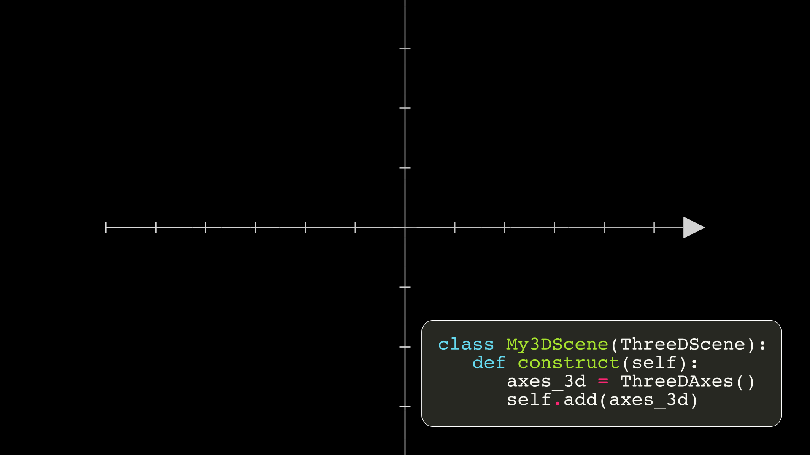
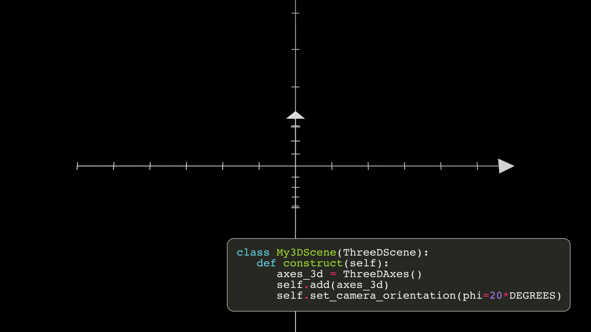
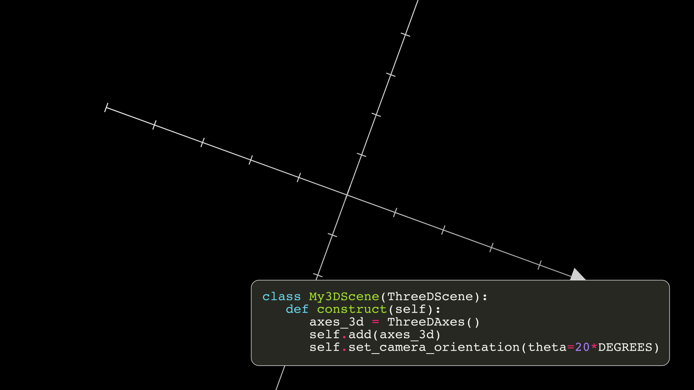
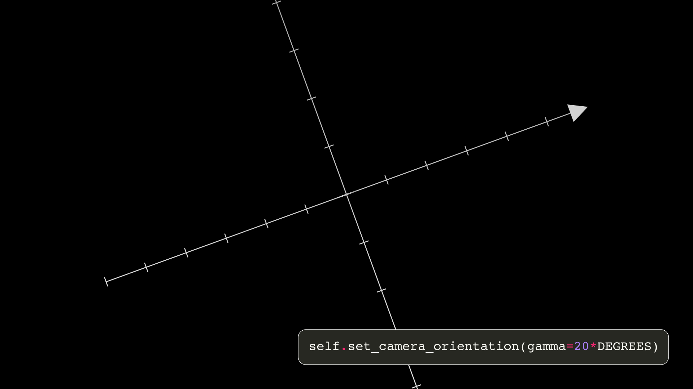
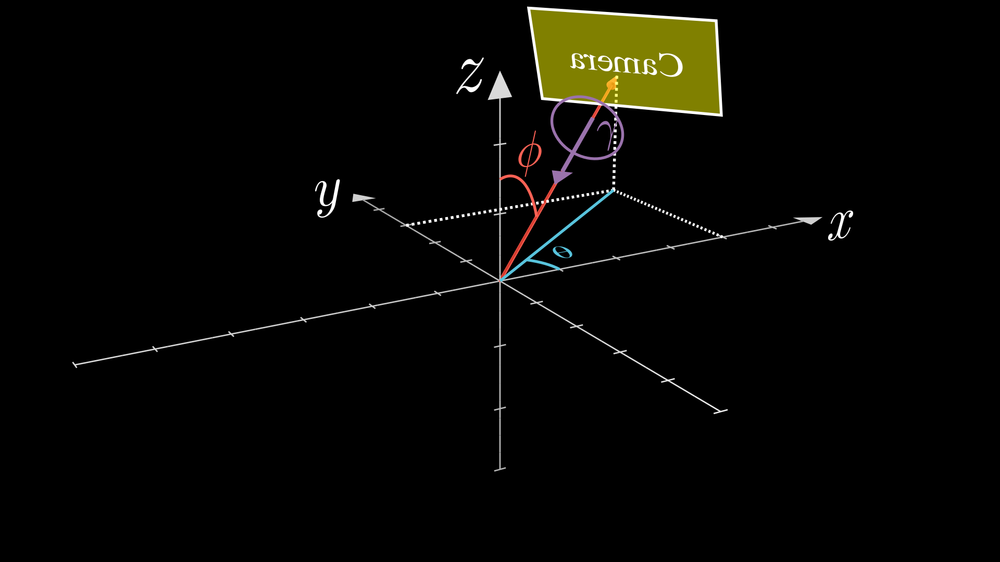
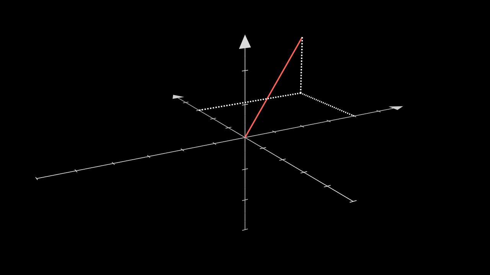

Basic 3D Graphs
=================

.. warning::

    If you are going to create very complex 3D animations, it is not recommended to use Manim, there are other much better tools, such as `Blender <https://www.blender.org/>`__. Use Manim when you really need it. In addition to the fact that a powerful computer is needed to be able to perform these scenes, if not, the rendering of the videos will be excessively slow. In later versions of Manim, the version with OpenGL will be available, which will allow us to use animations with the 3D camera much faster.

Setting camera
--------------------

In order to graph 3D scenes we need to activate the 3D camera, this is very simple, we just have to build our scenes using ``ThreeDScene`` instead of ``Scene``.

.. code-block:: python

    class My3DScene(ThreeDScene):
        pass

If you do this and make any animation, you will not notice the difference, for this you have to move the camera. For this, we are going to use the 3D axes, and we are going to compare by changing the camera angles.

From now on we are going to skip the first 4 lines:

.. code-block:: python

    class My3DScene(ThreeDScene):
        def construct(self):
            axes_3d = ThreeDAxes()
            self.add(axes_3d)

Recapping, the angles are like this:

.. raw:: html

    

    <video allowfullscreen style="position: absolute; top: 0; left: 0; width: 100%; height: 100%;" controls>
        <source src="../_static/basic_videos/_3DCamera.mp4" type="video/mp4">
    </video>
   

    

Moving camera
-----------------------

Note that by default ``theta=-90*DEGREES``.

.. raw:: html

    

    <video allowfullscreen style="position: absolute; top: 0; left: 0; width: 100%; height: 100%;" controls>
        <source src="../_static/basic_videos/MovingCameraExample.mp4" type="video/mp4">
    </video>
   

    

You can add animations when you perform the camera movement:

.. raw:: html

    

    <video allowfullscreen style="position: absolute; top: 0; left: 0; width: 100%; height: 100%;" controls>
        <source src="../_static/basic_videos/MC2.mp4" type="video/mp4">
    </video>
   

    

ThreeDAxes
-----------------------

If you are going to graph **surfaces**, the axes must have a ``unit_size=1``, that is, each unit of the camera must be a unit of the graphs, this is because ThreeDAxes does not have a method to create surfaces, so the surfaces use the camera's units of measure.

If you are only going to graph parametric curves or vectors you can use any ``unit_size``, you only have to be careful in the Z axis, since ``Axes.c2p`` does not contemplate the Z coordinate:

.. code-block:: python

    def construct(self):
        axes_3d = ThreeDAxes(
            # unit_size=1 in Z axis
            z_range=(-3,3,1),
            z_length=6,
        )
        self.set_camera_orientation(phi=70*DEGREES,theta=240*DEGREES)

        main_line        = Line(ORIGIN,axes_3d.c2p(4,3)+2*OUT,color=RED)
        vertical_line    = DashedLine(axes_3d.c2p(4,0),axes_3d.c2p(4,3))
        horizontal_line  = DashedLine(axes_3d.c2p(0,3),axes_3d.c2p(4,3))
        fall_line        = DashedLine(axes_3d.c2p(4,3),axes_3d.c2p(4,3)+OUT*2)

.. raw:: html

   

   
 Show result 

.. raw:: html

   

    

Parametric functions
-----------------------

.. code-block:: python

    def construct(self):
        axes_3d = ThreeDAxes()
        func = axes_3d.get_parametric_curve(
            lambda t: np.array([
                2*np.cos(t),
                3*np.sin(t),
                t/3
            ]),
            t_range=(-2*PI,2*PI,0.01),
            color=RED
        )

        self.set_camera_orientation(phi=70*DEGREES,theta=240*DEGREES)
        self.add(
            axes_3d,
            func
        )
        self.wait(0.5)
        self.move_camera(theta=120*DEGREES,run_time=6,rate_func=linear)
        self.wait(0.5)
        self.move_camera(theta=90*DEGREES,phi=0,run_time=2,rate_func=smooth)
        self.wait(0.5)

.. raw:: html

   

   
 Show result 

    

    <video allowfullscreen style="position: absolute; top: 0; left: 0; width: 100%; height: 100%;" controls>
        <source src="../_static/basic_videos/MC4.mp4" type="video/mp4">
    </video>
   

    

Surfaces
-----------------------

If you are going to graph **Surfaces** then it is necessary to normalize all ``unit_size`` on the axes to 1.

.. code-block:: python

    def construct(self):
        axes_3d = ThreeDAxes(
            x_range=(-6,6,1),
            x_length=12,
            y_range=(-5,5,1),
            y_length=10,
            z_range=(-3,3,1),
            z_length=6,
        )
        self.set_camera_orientation(phi=70*DEGREES,theta=240*DEGREES)

        surface = ParametricSurface(
            lambda u, v: np.array([
                np.cos(TAU * v),
                np.sin(TAU * v),
                2 * (1 - u)
            ]),
        ).fade(0.5) 

        paraboloid = ParametricSurface(
            lambda u, v: np.array([
                np.cos(v)*u,
                np.sin(v)*u,
                u**2
            ]),
            v_range=(0,TAU),
        ).fade(0.5) 

        para_hyp = ParametricSurface(
            lambda u, v: np.array([
                u,
                v,
                u**2-v**2
            ]),
            u_range=(-2,2),
            v_range=(-2,2),
        ).fade(0.5) 

        cone = ParametricSurface(
            lambda u, v: np.array([
                u*np.cos(v),
                u*np.sin(v),
                u
            ]),
            u_range=(-2,2),
            v_range=(0,TAU),
        )
        sphere = ParametricSurface(
            lambda u, v: np.array([
                1.5*np.cos(u)*np.cos(v),
                1.5*np.cos(u)*np.sin(v),
                1.5*np.sin(u)
            ]),
            #Resolution of the surfaces
            u_range=(-PI/2,PI/2),
            v_range=(0,TAU),
        )

        self.add(
            axes_3d,surface
        )
        self.play(
            Transform(surface, paraboloid)
        )
        self.wait(0.5)
        self.play(
            Transform(surface, para_hyp)
        )
        self.wait(0.5)
        self.play(
            Transform(surface, cone)
        )
        self.wait(0.5)
        self.play(
            Transform(surface, sphere)
        )
        self.wait(0.5)

.. raw:: html

   

   
 Show result 

    

    <video allowfullscreen style="position: absolute; top: 0; left: 0; width: 100%; height: 100%;" controls>
        <source src="../_static/basic_videos/MC5.mp4" type="video/mp4">
    </video>
   

    

Utilities
-----------------------

Fix Mobject to camera
""""""""""""""""""""""""""

Using ``ThreeDScene.add_fixed_in_frame_mobjects`` you make mobs always look at the screen fixed.

.. raw:: html

    

    <video allowfullscreen style="position: absolute; top: 0; left: 0; width: 100%; height: 100%;" controls>
        <source src="../_static/basic_videos/MC6.mp4" type="video/mp4">
    </video>
   

    

Arrow3D
""""""""""""""""""""""""""

.. code-block:: python

    def construct(self):
        axes_3d = ThreeDAxes(
            # unit_size=1 in Z axis
            z_range=(-3,3,1),
            z_length=6,
        )
        self.set_camera_orientation(phi=70*DEGREES,theta=240*DEGREES)
        # Arrows3Ds are surfaces, so the more you add, the longer it will take to render.
        main_line        = Arrow3D(ORIGIN,axes_3d.c2p(4,3)+2*OUT,color=GREEN,height=0.7,base_radius=0.2)
        vertical_line    = Arrow3D(axes_3d.c2p(4,0),axes_3d.c2p(4,3))
        horizontal_line  = Arrow3D(axes_3d.c2p(0,3),axes_3d.c2p(4,3))
        fall_line        = Arrow3D(axes_3d.c2p(4,3),axes_3d.c2p(4,3)+OUT*2)

        self.add(
            axes_3d,
            main_line,
            vertical_line,
            horizontal_line,
            fall_line,
        )
        self.wait(0.5)
        self.move_camera(theta=30*DEGREES,run_time=4)
        self.wait()
        

.. raw:: html

   

   
 Show result 

    

    <video allowfullscreen style="position: absolute; top: 0; left: 0; width: 100%; height: 100%;" controls>
        <source src="../_static/basic_videos/MC8.mp4" type="video/mp4">
    </video>
   

    