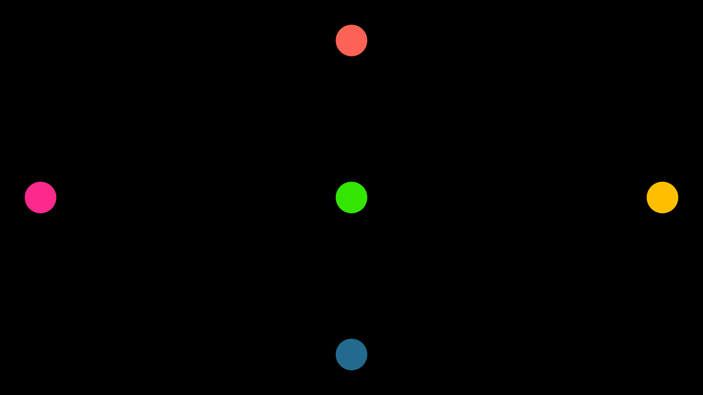

.. role:: underbold
    :class: underbold

Basic attributes of Mobjects
===============================

If you want to see a tree of what inheritance is like between Mobjects you can see the following diagram (created by the ManimCE community).

.. image:: ../_static/images/mob_tree.svg

Camera dimensions
-------------------

Before studying the attributes of Mobjects it is necessary to know the basic characteristics of the camera.

By default, the **Camera** is 8 units high, and since the aspect ratio is 16/9, the width can be easily calculated.
These 8 units are independent of the rendering resolution (480p, 720p, etc), so there is no need to worry about that.

The coordinates of each Mobject are a three-dimensional array, and the coordinate :math:`[0,0,0]` is located in the center of the camera.

.. image:: ../_static/images/camera_coordinates.png

For now, we will not worry about the 3rd dimension, we will focus only on the x, y coordinates.

.. note::
    These values can be changed but it is not recommended.

Basic attributes
-------------------

All Mobjects have four main attributes:

* Position
* Width
* Height
* Z index

We won't study **Z index** in this section until **Section 4**.

To start studying the properties we will create a rectangle and add it on the screen, I recommend the student to use Jupyter-Notebook to study these first sections.
We will omit the scene name to save space.

.. code:: python

    def construct(self):
        req = Rectangle()
        self.add(req)

.. image:: ../_static/images/cp1.png

Position
-------------------

Manim already has some constants that will help us locate our Mobjects, which are:

:underbold:`Origin:`

.. code:: python

    ORIGIN = np.array([ 0, 0, 0])

:underbold:`One-dimensional vectors:`

.. code:: python

    UP    = np.array([ 1, 0, 0])
    DOWN  = np.array([-1, 0, 0])
    RIGHT = np.array([ 0, 1, 0])
    LEFT  = np.array([ 0,-1, 0])

:underbold:`Two-dimensional vectors:`

.. code:: python

    UR = np.array([ 1, 1, 0])
    UL = np.array([-1, 1, 0])
    DR = np.array([ 1,-1, 0])
    DL = np.array([-1,-1, 0])

When we instantiate a Mobject, it is always located by default in the center of the screen, that is, in the location :math:`[0,0,0]`.

If we want to place this object in another position, there are two positioning systems:

* **Absolute Position**: Use as reference the coordinates of the camera or the current location of our Mobject.

    * ``Mobject.move_to()``
    * ``Mobject.shift()``

* **Relative Position**: We use another Mobject or coordinate as a reference to locate our Mobject.
    
    * ``Mobject.to_edge()``
    * ``Mobject.to_corner()``
    * ``Mobject.next_to()``
    * ``Mobject.align_to()``

Absolute Position
-------------------

Mobject.move_to()
""""""""""""""""""""""

This method requires a three-dimensional array (coordinate) to locate an object on the screen, **always use the center of the camera center as a reference**.

.. warning::
    Remember that if you place a Mobject outside the limits of the camera then your Mobject will not be visible in your animation, although Manim will have computed it.

.. code:: python

    def construct(self):
        req = Rectangle()
        req.move_to([-3,2,0])
        self.add(req)

In general, it is advisable to convert your coordinates to ``np.array``, or to use linear combinations of the **one-dimensional** or **two-dimensional** vectors to locate your objects.

.. code:: python

    def construct(self):
        r = Rectangle()
        c = Circle()
        e = Ellipse()
        # Best practice
        r.move_to( np.array([-3, 2, 0]) )
        # Other way
        c.move_to( LEFT * 3 + UP * 2 )
        # Another way
        e.move_to( UL * 2 + LEFT )
        
        self.add(r,c,e)

.. image:: ../_static/images/ap2.png

Mobject.shift()
""""""""""""""""""""""

This method is similar to ``move_to``, but the difference is that ``move_to`` :underbold:`always refers to the center of the camera` (the origin), while ``shift`` refers to the **current** position of your Mobject.

To differentiate it, let's look at the following case:

.. code:: python

    def construct(self):
        s = Square()
        c = Circle()
        # Apply move_to 4 times
        for _ in range(4):
            s.move_to(RIGHT)
        
        # Apply shift 4 times
        for _ in range(4):
            c.shift(RIGHT)
        
        self.add(s,c)

.. image:: ../_static/images/ap3.png

If we apply the same ``move_to`` 4 times, then it is redundant, because the movement always takes the **center** of the camera as a reference.

But applying ``shift`` 4 times is different, because each shift takes the new Mobject coordinates as a reference.

This can be made even clearer with an animation:

.. code:: python

    def construct(self):
        s = Square()
        c = Circle()
        
        self.add(s,c)
        
        for _ in range(4):
            # Pause
            self.wait()
            # Move
            c.shift(RIGHT)
            s.move_to(RIGHT)

.. raw:: html

    

    <video allowfullscreen style="position: absolute; top: 0; left: 0; width: 100%; height: 100%;" controls>
        <source src="../_static/images/ap4.mp4" type="video/mp4">
    </video>
    

     

You can notice that at the beginning both appear in the center of the camera, then the first cycle of the loop is applied and both move once to the right, but the second time only the circle (to whom the ``shift`` is applied) is it keeps moving, because the new ``shift`` (of the following loops) takes the new Mobject (circle) coordinates as a reference.

Mobject.get...
""""""""""""""""""""""""

To obtain the coordinates of an object we can use the following getters:

.. code:: python

    def construct(self):
        r = Rectangle()
        self.add(r)
        
        center = r.get_center()
        right  = r.get_right()
        left   = r.get_left()
        top    = r.get_top()
        bottom = r.get_bottom()
        
        up_right   = r.get_corner(UR)
        up_left    = r.get_corner(UL)
        down_right = r.get_corner(DR)
        down_left  = r.get_corner(DL)
        
        for n,p in zip(
            ["C"   ,"R"  ,"L" ,"T","B"   ,"UR"    ,"UL"   ,"DR"      ,"DL"],
            [center,right,left,top,bottom,up_right,up_left,down_right,down_left]
        ):
            t = Text(f"{n}",color=RED)
            t.move_to(p)
            self.add(t)

.. image:: ../_static/images/ap5.png

.. warning::

   It is important to note that ``.get_center()`` :underbold:`does not get` the geometric center or center of mass of the Mobject. What ``.get_center()`` does is "create" an *imaginary* rectangle whose borders contain the entirety of your Mobject and then it returns the coordinates of that rectangle. If you need to obtain the center of mass of a Mobject use ``get_center_of_mass()``.

Also exists:

.. code:: python

    Mobject.get_x() # <==> Mobject.get_center()[0]
    Mobject.get_y() # <==> Mobject.get_center()[1]
    Mobject.get_z() # <==> Mobject.get_center()[2]

    # N is some real number
    Mobject.set_x(N) # <==> Mobject.move_to(RIGHT * N)
    Mobject.set_y(N) # <==> Mobject.move_to(UP    * N)
    Mobject.set_z(N) # <==> Mobject.move_to(OUT   * N)

Relative Position
-------------------

Mobject.to_edge()
""""""""""""""""""""""

This method moves vertically or horizontally to some edge of the camera, takes a **one-dimensional** vector as an argument and moves the Mobject in that direction to the edge.

:underbold:`Examples`:

.. code:: python

    def construct(self):
        req = Rectangle()
        req.to_edge(LEFT)
        self.add(req)

.. image:: ../_static/images/cp2.png

.. code:: python

    def construct(self):
        req = Rectangle()
        req.to_edge(UP)
        self.add(req)

.. image:: ../_static/images/cp3.png

We can even use this method twice to move an object to a corner:

.. code:: python

    def construct(self):
        req = Rectangle()
        req.to_edge(UP)
        req.to_edge(LEFT)
        self.add(req)

.. image:: ../_static/images/cp4.png

This method admits a parameter called ``buff`` (buffer), this parameter indicates a gap between the border and your object, by **default** the value of this buffer is **0.5 units**, but we can reduce this gap to zero using:

.. code:: python

    def construct(self):
        req = Rectangle()
        req.to_edge(UP)
        req.to_edge(LEFT,buff=0)
        self.add(req)

Mobject.to_corner()
""""""""""""""""""""""

This method requires a two-dimensional vector, and places your Mobject in the corner. It is equivalent to using ``Mobject.to_edge()`` twice. It also supports the ``buff`` parameter.

.. code:: python

    def construct(self):
        req = Rectangle()
        req.to_corner(UL)
        self.add(req)

.. code:: python

    def construct(self):
        req = Rectangle()
        req.to_corner(DR,buff=0)
        self.add(req)

.. image:: ../_static/images/cp7.png

Mobject.next_to()
""""""""""""""""""""""

This method uses the **edge** of a Mobject/point and positions our Mobject in the direction of that edge, the format is as follows:

.. code:: python

    Mobject.next_to(REFERENCE_MOBJECT_OR_POINT, DIRECTION, buff=BUFFER, aligned_edge=EDGE)

Here we see some examples:

.. code:: python

    def construct(self):
        # Reference Mobject:
        rm  = Rectangle()
        # Mobjects that we want to move:
        red_dot    = Dot(color=RED)
        blue_dot   = Dot(color=BLUE)
        green_dot  = Dot(color=GREEN)
        t = Text("Some text")
        # Set positions
        red_dot.next_to(rm, LEFT)

        blue_dot.next_to(rm, LEFT, buff=0)

        green_dot.next_to(rm, DR, buff=0)

        t.next_to(rm, DOWN, aligned_edge=LEFT)
        #                   -----------------
        #               Delete this parameter and see what
        #               happens, then change LEFT to RIGHT
        
        self.add(
            rm, 
            red_dot, 
            blue_dot, 
            green_dot,
            t
        )

.. image:: ../_static/images/cp8.png

You can notice that ``.next_to()`` will never move a Mobject to the center of another Mobject, it always takes as a reference the edge that you indicate in the second argument.

The parameter ``aligned_edge`` allows you to **align** your Mobject with the edge of the *reference Mobject*.

Mobject.align_to()
""""""""""""""""""""""

This is a somewhat complicated method to understand, but quite useful, its behavior is similar to what you saw with the ``aligned_edge`` parameter of ``.next_to()``.

.. image:: ../_static/images/alignto.png

.. code:: python

    def construct(self):
        c = Circle()
        c.move_to(RIGHT * 3 + UP * 1.5)
        
        r = Rectangle()
        r.align_to(c,RIGHT)
        
        self.add(c,r)

.. image:: ../_static/images/cp9.png

Also works with corners:

.. code:: python

    def construct(self):
        r = Rectangle()
        r.move_to(RIGHT * 3 + UP * 1.5)
        
        t = Text("Hello")
        t.align_to(r,UR)
        
        self.add(r,t)

Width and Height
-------------------

Setting
"""""""""

Obviously, all Mobjects have height and width, additionally, three-dimensional Mobjects also have depth.
To be able to modify them it is very simple:

.. code:: python

    def construct(self):
        c = Circle()
        r = Rectangle()
        
        # replace "width" with "height
        # and see what happens
        c.width = 3
        r.width = 3
        
        self.add(c,r)

.. image:: ../_static/images/wh1.png

We can also pass the width from one Mobject to another like this:

.. code:: python

    def construct(self):
        c = Circle()
        r = Rectangle()
        
        # replace "width" with "height
        # and see what happens
        c.width = r.width
        # or
        c.scale_to_fit_width(r.width)
        # c.scale_to_fit_height(r.height)
        
        self.add(c,r)

.. image:: ../_static/images/wh2.png

Another way to define the width or height is using the ``.set`` method:

.. code:: python

    def construct(self):
        c = Circle()
        r = Rectangle()
        
        # replace "width" with "height
        # and see what happens
        c.set(width=3)
        r.set(width=3)
        
        self.add(c,r)

Stretch
"""""""""""

If you don't want the proportions of your Mobject to be kept when changing the width or height then you can use ``.stretch_to_fit_height()`` or ``.stretch_to_fit_width()``:

.. code:: python

    def construct(self):
        c = Circle()
        t = Triangle()
        r = Rectangle()
        
        t.stretch_to_fit_height(c.height)
        r.stretch_to_fit_width(c.width)
        
        t.move_to(c.get_center()) # What happend if you remove this line
        
        self.add(c,t,r)

Scale
"""""""""""

.. code:: python

    def construct(self):
        # Original circle
        c_original = Circle(color=RED)
        # x2
        c_x_2      = Circle(color=WHITE)
        c_x_2.scale(2)
        # x3
        c_x_3      = Circle(color=BLUE)
        c_x_3.scale(3)
        # x 1/3
        c_x_1_3    = Circle(color=GREEN)
        c_x_1_3.scale(1/3)
        
        self.add(
            c_original,
            c_x_2,
            c_x_3,
            c_x_1_3
        )

.. image:: ../_static/images/wh3_2.png

Apply Matrix
""""""""""""""

As its name indicates, it applies a **linear transformation** to a Mobject, you can use the following image as a reference. This is a generalization of all the properties previously seen.

.. image:: ../_static/images/apply_matrix.svg

.. code:: python

    def construct(self):
        sq_phantom = Square()
        sq = Square(color=RED)
        
        ANGLE = PI / 6
        # Reference point
        POINT = sq.get_corner(DL)
        
        matrix = [
            [1,np.tan(ANGLE),0],
            [0,1,0],
            [0,0,0]
        ]
    
        sq.apply_matrix(matrix,about_point=POINT)
        
        self.add(sq_phantom, sq)

.. image:: ../_static/images/wh4.png

VMobject attributes
---------------------

The previously studied properties work for any Mobject, now we will study the properties that only VMobjects have. The most common VMobjects are:

* ``SVGMobject``

    * Some Subclasses: ``Text``, ``Tex``, ``MathTex``, ``MarkupText``, etc.

* Geometry VMobjects:

    * ``Line``, ``Arrow``, ``Circle``, ``Rectangle``, etc.

Color palette
"""""""""""""""""

ManimCE's official documentation gives us all the default colors:

.. image:: ../_static/images/color_pallete.png

You must write them in capital letters.

.. note:: 
    The colors of type “C” have an alias equal to the colorname without a letter, e.g.
    
    GREEN = GREEN_C

You can define the color using the hexadecimal format, with RGB or with HSL:

.. code:: python

    def construct(self):
        from colour import Color
        def HSL(hue,saturation=1,lightness=0.5):
            return Color(hsl=(hue/360,saturation,lightness))
        
        red_dot    = Dot(color=RED)          .scale(4)    .to_edge(UP)
        blue_e_dot = Dot(color=BLUE_E)       .scale(4)    .to_edge(DOWN)
        hex_dot    = Dot(color="#FE298D")    .scale(4)    .to_edge(LEFT)
        rgb_dot    = Dot(color=rgb_to_color([0.2,0.9,0])).scale(4)
        hsl_color  = Dot(color=HSL(45,1,0.5)).scale(4)    .to_edge(RIGHT)
        
        
        self.add(
            red_dot, blue_e_dot,
            hex_dot, rgb_dot, hsl_color
        )

Stroke width, fill and opacity
"""""""""""""""""""""""""""""""""""

.. code:: python

    def construct(self):
        background_square = Square(
            fill_opacity=1,
            fill_color=WHITE,
        )
        background_square.scale(1.5)
        
        circle = Circle(
            # stroke options
            stroke_width=20,
            stroke_color=TEAL,
            stroke_opacity=0.5, # 0 <= stroke_opacity <= 1
            # fill options
            fill_opacity=0.5,   # 0 <= fill_opacity <= 1
            fill_color=ORANGE
        )
        
        
        self.add(
            background_square,
            circle
        )

A quick way to set a color is using ``.set_color(SOME_COLOR)``, in case you have already defined the color of the stroke width or the fill, both properties will take the color that you indicated in the ``.set_color()`` method.

.. code:: python

    def construct(self):
        c = Circle(
            stroke_color=PINK,
            stroke_width=30,
            stroke_opacity=0.4,
            fill_opacity=0.6,
            fill_color=ORANGE
        )
        
        c.set_color(RED)
        
        self.add(c)

Points, start and end
"""""""""""""""""""""""""""""""""""

As we explained at the beginning, all VMobjects are bézier curves, and therefore have control points, you can visualize them quite easily:

.. code:: python 

    def construct(self):
        c = Circle()
        # c.points are the control points
        for p in c.points:
            d = Dot().move_to(p)
            self.add(d)
            
        self.add(c)

.. image:: ../_static/images/po1.png

You can even modify the points at runtime:

.. code:: python

    def construct(self):
        c = Circle()
        c.points[4] += LEFT
        
        for p in c.points:
            d = Dot().move_to(p)
            self.add(d)
            
        self.add(c)

In general, this type of manipulation is not useful, but with this we can obtain the starting and ending point of our path. In general, this type of manipulation is not useful, but thanks to this we can obtain the starting and ending point of our path. It is very useful when we use it with ``Line`` or similar.

.. code:: python

    def construct(self):
        arrow = Arrow(LEFT,UR)
        arrow.shift(LEFT+DOWN)
        
        arrow_start = arrow.get_start() # same as arrow.points[0]
        arrow_end   = arrow.get_end()   # same as arrow.points[-1]
        
        dot_start = Dot(color=RED).move_to(arrow_start)
        dot_end   = Dot(color=BLUE).move_to(arrow_end)
        
        self.add(arrow, dot_start, dot_end)

.. image:: ../_static/images/po3.png

Copies and setters
-----------------------------

Sometimes it is convenient to copy an **instance** of a Mobject, to do this we can use the ``.copy()`` method.

.. code:: python

    def construct(self):
        original_circle = Circle(
            radius=2,
            stroke_color=PINK,
            stroke_width=30,
            stroke_opacity=0.4,
            fill_opacity=0.6,
            fill_color=ORANGE
        )
        original_circle.to_edge(LEFT)
        
        copy_circle = original_circle.copy()
        copy_circle.to_edge(RIGHT)
        # set_color
        copy_circle.set_color(RED)
        # set_stroke
        copy_circle.set_stroke(color=TEAL,width=50,opacity=1)
        # set_fill
        copy_circle.set_fill(color=PURE_BLUE,opacity=1)
        
        another_copy_circle = copy_circle.copy()
        another_copy_circle.move_to(ORIGIN)
        # set_style
        another_copy_circle.set_style(
            stroke_width=30,
            stroke_color=WHITE,
            stroke_opacity=0.5,
            fill_color=PURE_GREEN,
            fill_opacity=0.3,
        )

As you can see, it is possible to change the thickness and padding properties after the instance, either by using ``.set_stroke()``, ``.set_fill()``, or by using ``.set_style()``.

.. note::

    The ``.copy()`` method works with any Mobject, not just VMobjects.

Exercises
------------

1. Create a grid in which you can see the coordinates of the screen:

2. Draw the Yin-Yang symbol.

3. Draw the VUE.js logo.