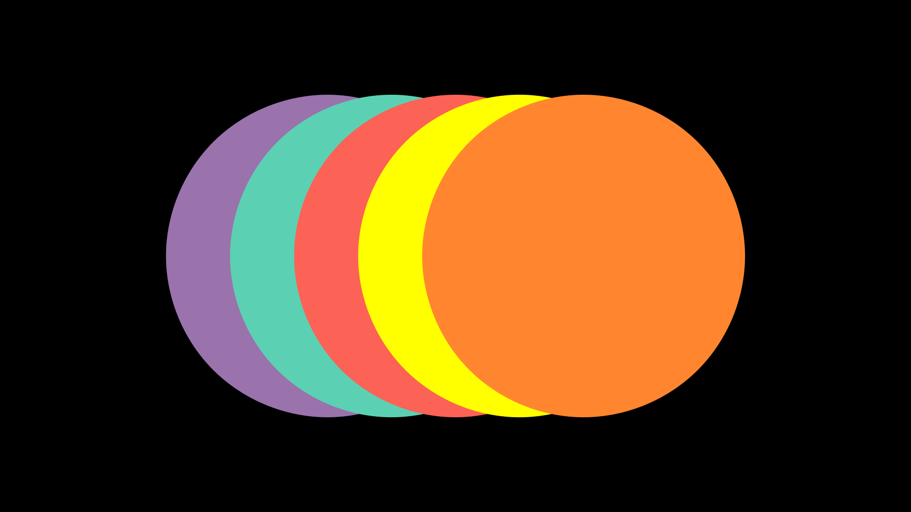

Layers
==============

There are two factors that Manim takes into account when superimposing one Mobject on top of another when rendering a scene:

1. The order in which the Mobjects are added to the scene using ``Scene.add`` or ``Scene.play``.
2. The ``z_index``.

``Scene.mobjects``
--------------------

When you add a Mobject to the scene (either with ``Scene.add`` or ``Scene.play``), Manim adds that Mobject to a list called ``Scene.mobjects`` in the order in which they are added in the code, and by default, to all Mobjects they are assigned a ``z_index`` = 0.

See this code:

.. code-block:: python

    def construct(self):
        mob_kwargs = {"fill_opacity": 1}

        c_red    = Circle(color=RED,**mob_kwargs).shift(LEFT)
        t_teal   = Triangle(color=TEAL,**mob_kwargs)
        s_purple = Square(color=PURPLE,**mob_kwargs).shift(RIGHT)

        [mob.scale(2) for mob in [c_red, t_teal, s_purple]]

        self.add(c_red,t_teal)    # L1
        self.add(s_purple)        # L2
        # Print list
        print(self.mobjects)

OUT:

.. code:: bash

    [Circle, Triangle, Square]

.. image:: ../_static/images/ly1.png

If you play with the commented lines with ``L1`` and ``L2`` changing the order of how you add the Mobjects you will see that the list and that the Mobjects in the camera change.

Specifically, the first is to be added to the bottom, the second overlaps the first, and the third overlaps the first two, and so on.

``z_index``
--------------------

Sometimes it is difficult to control the order of the Mobjects in the Scene.mobjects list, so the z_index functionality was added.

By default, all Mobjects have ``z_index`` = 0, but you can change this using ``Mobject.set_z_index(INDEX)``.

Play with the following code:

.. code-block:: python

    def construct(self):
        mob_kwargs = {"fill_opacity":1,"radius":2.5}
        mob_teal   = Circle(color=TEAL,**mob_kwargs)\
            .shift(LEFT)
        mob_purple = Circle(color=PURPLE,**mob_kwargs)\
            .shift(LEFT*2)
        mob_red    = Circle(color=RED,**mob_kwargs)
        mob_yellow = Circle(color=YELLOW,**mob_kwargs)\
            .shift(RIGHT)
        mob_orange = Circle(color=ORANGE,**mob_kwargs)\
            .shift(RIGHT*2)
        
        mob_purple.set_z_index(0)
        mob_teal  .set_z_index(1)
        mob_red   .set_z_index(2)
        mob_yellow.set_z_index(3)
        mob_orange.set_z_index(4)
        
        self.add(mob_purple, mob_teal,mob_red,mob_yellow,mob_orange)

And the best thing is that these positions are fulfilled in the animations and in 3D scenes.

If two Mobjects have the same ``z_index`` then the ``Scene.mobjects`` list rule will apply.
