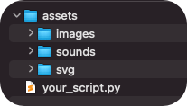
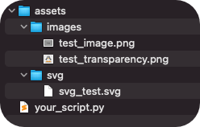

Import assets
==================

To understand how assets are imported into Manim, you first have to set a workspace, that is, a folder.

It is advisable to create a folder for assets and each type of document, for example:

.. code-block::

    .
    ├── assets
    │   ├── images
    │   ├── sounds
    │   └── svg
    │
    └── your_script.py

Images and SVG
-------------------

Manim supports PNG images (opaque or with transparency), JPEG, JPG and SVG. However, SVGs must be well built, that is, they must not have errors in their code for it to work.

Download the following files:

* Normal raster image: :download:`test_image <../_static/images/test_image.png>`.
* PNG with transparency: :download:`test_transparency <../_static/images/test_transparency.png>`.
* SVG: :download:`svg_test <../_static/images/svg_test.svg>`.

And locate them as follows:

.. code-block::

    ├── assets
    │   ├── images
    │   │   ├── test_image.png
    │   │   └── test_transparency.png
    │   │
    │   └── svg
    │       └── svg_test.svg
    │
    └── your_script.py

The way to import it is as follows:

.. code-block:: python

    def construct(self):
        # Change background color only this scene
        self.camera.background_color = TEAL
        test_image = ImageMobject("assets/images/test_image.png")
        test_image.to_corner(LEFT)
        test_image.set(width=3)

        test_transparency = ImageMobject("assets/images/test_transparency.png")
        test_transparency.set(width=3)

        svg = SVGMobject("assets/svg/svg_test")
        svg.set(width=3)
        svg.to_edge(RIGHT)

        self.add(
            test_image,
            test_transparency,
            svg
        )

        self.wait()

.. note::

    Note that ``ImageMobject`` and ``SVGMobject`` refer to the directory where you are running Manim (your workspace).

.. warning::

    Class animations that were designed for ``VMobjects`` cannot be applied to ``ImageMobjects``. ``ImageMobjects`` are not ``VMobjects``. For example, ``Write`` cannot be applied to an ``ImageMobject``, but ``FadeIn`` or ``FadeOut`` can.

Sounds
------------

The same logic is applied as the images, it is recommended to create a folder called ``sounds``, here is an example, download the following files and locate them in this way:

.. code-block::

    ├── assets
    │   └── sounds
    │       ├── count.wav
    │       └── finish.wav
    │
    └── your_script.py

* Sound 1: :download:`count.wav <../_static/images/count.wav>`.
* Sound 2: :download:`finish.wav <../_static/images/finish.wav>`.

Code:

.. code-block:: python

    def construct(self):
        for i in range(5):
            t = Text(f"{i+1}")
            t.set(height=config.frame_height - 2)
            self.add(t)
            if i != 4:
                # "gain" is the amplification of the sound
                self.add_sound("assets/sounds/count.wav",gain=3)
            else:
                self.add_sound("assets/sounds/finish.wav",gain=3)
            self.wait()
            self.remove(t)

.. raw:: html

    

    <video allowfullscreen style="position: absolute; top: 0; left: 0; width: 100%; height: 100%;" controls>
        <source src="../_static/basic_videos/SoundScene.mp4" type="video/mp4">
    </video>
    

     

.. warning::

    It is recommended to use the ``--flush_cache`` flag, as sometimes the cache can cause the rendering to not work quite well, example:

    ``manim your_script.py SomeScene -pqm --flush_cache``