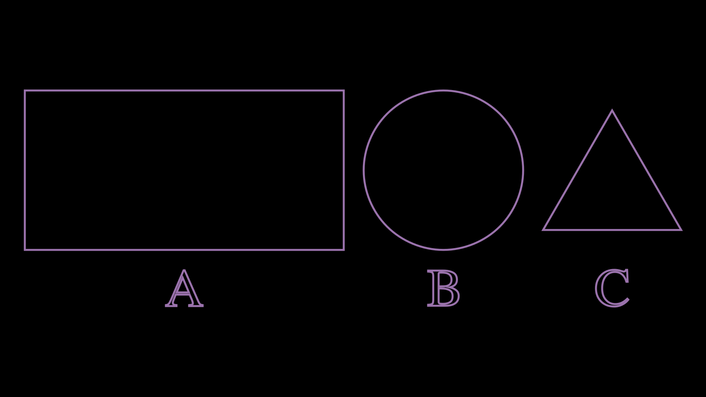

Groups and VGroups
======================

Sometimes it is very necessary to group several ``Mobjects`` to apply some Manim method to them.

For example, suppose we want to apply a ``shift`` to several ``Mobjects``, it is true that we can group them in an array and make a loop, but it is much faster to group them in a ``Group`` and apply the ``shift`` to that ``Group``.

The difference between ``Group`` and ``VGroup`` is simple, ``Group`` supports any ``Mobject``, such as ``ImageMobject`` and ``VMobjects``, but ``VGroup`` only supports ``VMobjects``.

Groups
------------

``Group`` support any method of Mobjects, such as ``shift``, ``scale``, ``move_to``, ``next_to``, ``align_to``, etc. However you cannot apply VMobjects methods to them, such as ``set_stroke`` or ``set_fill``, if you want to use those methods then you will have to use a ``VGroup``.

Two additional methods that are very useful are ``arrange`` and ``arrange_in_grid``, they work quite simply:

.. raw:: html

    

    <video allowfullscreen style="position: absolute; top: 0; left: 0; width: 100%; height: 100%;" controls>
        <source src="../_static/basic_videos/ArrangeScene.mp4" type="video/mp4">
    </video>
    

     

It should be noted that when we apply ``arrange`` or ``arrange_in_grid``, all Mobjects move to the center of the screen.

VGroups
-----------

They are exactly the same as Groups, but you can apply the VMobjects methods, such as ``set_stroke``, ``set_fill``, ``set_style``, etc.

.. code-block:: python

    def construct(self):
        grp = VGroup(
            Rectangle(), Circle(), Triangle(),
            Text("A"),Text("B"),Text("C"),
        )
        grp.set_style(
            fill_opacity=0,
            stroke_width=4,
            stroke_color=PURPLE
        )
        grp.arrange_in_grid(cols=3)
        grp.width = config.frame_width - 1
        self.add(grp)

As arrays
--------------

Another advantage is that you can add, select and remove elements as you would with an array.

* To add elements use ``Group.add(some_mobject)``
* To remove elements, use ``Group.remove(some_mobject)``, with the indication that ``some_mobject`` must already be included in the ``Group``.
* To select an item use ``Group[i]`` where ``i`` is a number, or a range, like ``Group[3:5]``. If you use range then the return is another ``Group`` with those elements.

.. raw:: html

    

    <video allowfullscreen style="position: absolute; top: 0; left: 0; width: 100%; height: 100%;" controls>
        <source src="../_static/basic_videos/ArrangeScenex.mp4" type="video/mp4">
    </video>
    

     

Using list comprehension
--------------------------

This technique is quite useful when we need to create Groups more quickly.

.. code-block:: python

    def construct(self):
        from itertools import cycle
        colors = cycle([RED,TEAL,ORANGE,PINK])
        grp = VGroup(*[
            Text(n,color=next(colors))
                .scale(4)
            for n in "ManimCE"
        ])
        grp.arrange(RIGHT,aligned_edge=DOWN)

        self.add(grp)

List comprehensions are quite useful in Manim, we will use them later in other chapters.