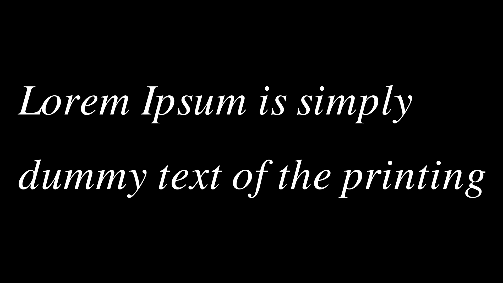
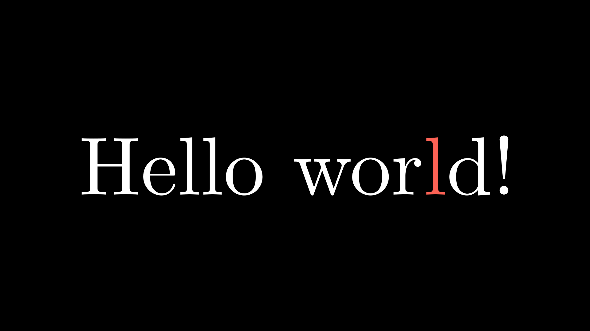

Text and Tex
===============

There are three ways to create texts in Manim:

* With system fonts: ``Text``.
* With PangoMarkup: ``MarkupText``.
* With LaTeX: ``Tex`` and ``MathTex``.

The simplest is with ``Text``, so we'll start with that.

Text
-----------

Fonts
"""""""""""

``Text`` is a subclass of ``SVGMobject``. The text is rendered using **Pango** and uses the fonts you have installed.

To see all the fonts you can use the command:

.. code-block:: bash

    python -c "import manimpango; from pprint import pprint; pprint(manimpango.list_fonts())"

It will give you an output like this:

.. code-block:: 

    ['Academy Engraved LET',
    'Al Bayan',
    'Al Nile',
    'Al Tarikh',
    'American Typewriter',
    'Andale Mono',
    'Apple Braille',
    'Apple Chancery',
    'Apple Color Emoji',
    'Apple SD Gothic Neo',
    'Apple Symbols',
    'AppleGothic',
    'AppleMyungjo',
    ....
    ....
    ]

If you use a shell like BASH (or similar) you can do something like this:

.. code-block::

    python -c "import manimpango; from pprint import pprint; pprint(manimpango.list_fonts())" | grep -i arial

To filter your search.

How to use it
""""""""""""""""""

Since it is an ``SVGMobject``, then you can use all the methods of the VMobjects, i.e. set the ``stroke_width``, ``fill_opacity``, etc. By default the stroke is 0, but you can change that yourself.

.. code-block:: python

    def construct(self):
        t = Text("Hello world")
        self.add(t)

I invite you to change the color, stroke width, fill color, stroke color, etc. Either using methods after the instance, or at the time of the instance.

To indicate the font we want to use, we can indicate it in the "font" parameter:

.. code-block:: python

    def construct(self):
        t = Text("Hello world", font="Arial")
        self.add(t)

As array
""""""""""""

Text can be understood as SVG arrays, and thanks to this you can select each letter:

.. code-block:: python

    def construct(self):
        t = Text("Hello world", font="Arial")
        t[0].set_color(RED)
        t[3].set_color(TEAL)
        self.add(t)

.. raw:: html

   

   
 Show result 

.. image:: ../_static/images/tx1.png

.. raw:: html

   

    

Line spacing
""""""""""""""""

If the text is long enough you can use triple quotes:

.. code-block:: python

    def construct(self):
        t = Text(
            """
            Lorem Ipsum is simply dummy text of the printing and typesetting industry.
            Lorem Ipsum has been the industry's standard dummy text ever since the 1500s,
            when an unknown printer took a galley of type and scrambled it to make a
            type specimen book.
            """,
            line_spacing=1.3 # space between lines
        )
        t.width = config.frame_width - 1
        t[0].set_color(RED)
        self.add(t)

.. raw:: html

   

   
 Show result 

.. raw:: html

   

    

But if you want to do it in a single line, you can do it using ``\n``:

.. code-block:: python

    def construct(self):
        t = Text(
            "Lorem Ipsum is simply\ndummy text of the printing",
            line_spacing=1.3 # space between lines
        )
        t.width = config.frame_width - 1
        self.add(t)

.. raw:: html

   

   
 Show result 

.. image:: ../_static/images/tx3.png

.. raw:: html

   

    

Slant and Weight
""""""""""""""""""

Slant is the style of the Text, and it can be NORMAL (the default), *ITALIC* or *OBLIQUE*. Usually, for many fonts both *ITALIC* and *OBLIQUE* look similar, but *ITALIC* uses Roman Style, whereas *OBLIQUE* uses Italic Style.

.. code-block:: python

    def construct(self):
        t = Text(
            "Lorem Ipsum is simply\ndummy text of the printing",
            line_spacing=1.3, # space between lines
            slant=ITALIC
        )
        t.width = config.frame_width - 1
        self.add(t)

.. raw:: html

   

   
 Show result 

.. raw:: html

   

    

The different types of weight can be obtained from ManimPango:

.. code-block:: python

    def construct(self):
        import manimpango as mp
        weight_list = dict(
            sorted(
                {
                    weight: mp.Weight(weight).value
                    for weight in mp.Weight
                }.items(), key=lambda x: x[1])
        )
        
        grp = VGroup(*[
            Text(weight.name, weight=weight.name, font="Open Sans")
            for weight in weight_list
        ]).arrange(DOWN)
        grp.height = config.frame_height - 1
        self.add(grp)

.. raw:: html

   

   
 Show result 

.. raw:: html

   

    

Text to *
""""""""""""""""

There are some functions that allow us to manipulate sections of text in a simple way, however, if there are repetitions of text, these functions may not behave correctly.

.. code-block:: python

    def construct(self):
        grp = VGroup(
            # Text to color
            Text("Hello",t2c={"[1:-1]": BLUE}),
            Text("World",t2c={"rl": RED}),
            # Text to font
            Text("Manim",t2f={"an": "Open Sans"}),
            Text("Manim",t2f={"[2:-1]": "Open Sans"}),
            # Text to gradient
            Text("Hello",t2g={"[1:-1]": (RED,GREEN)}),
            Text("World",t2g={"World": (RED,BLUE)}),
            # Text to slant
            Text("Manim",t2s={"an": ITALIC}),
            Text("Manim",t2s={"[2:-1]": ITALIC}),
            # Text to weight
            Text("Manim",t2w={"an": THIN}, font="Open Sans"),
            Text("Manim",t2w={"[2:]": HEAVY}, font="Open Sans"),
            # Ligature
            Text("fl ligature",font_size=40),
            Text("fl ligature", disable_ligatures=True, font_size=40),
        ).arrange_in_grid(cols=2).scale(1.4)

        self.add(grp)

.. raw:: html

   

   
 Show result 

.. image:: ../_static/images/tx6.png

.. raw:: html

   

    

MarkupText
------------------

``MarkupText`` is a class that uses **PangoMarkup**, language similar to **HTML** that allows us to modify the text with **XML** tags, if you understand **HTML or **XML** then it will be easy for you to understand this class.

.. code-block:: python

    def construct(self):
        text = MarkupText(
            f'Normal <i>Italic</i> <b>Bold</b> <u>Underline</u> Blue text'
        )
        self.add(text)

I recommend reading the `official documentation <https://docs.manim.community/en/stable/reference/manim.mobject.svg.text_mobject.MarkupText.html#manim.mobject.svg.text_mobject.MarkupText>`_ if you want to learn how to use this tool as it has many configurations.

.. raw:: html

   

   
 Show result 

.. raw:: html

   

    

Tex
--------

This is the most complex class, not only because it is the one with the most options, but because LaTeX is a world of its own.

If you do not have knowledge of LaTeX I recommend that you watch a 1-2 hour tutorial on the internet.

Templates
"""""""""""""""

As you should know, to use LaTeX you must include the libraries you want to use, by default, Manim uses this template:

.. code-block:: tex

    \usepackage[english]{babel}
    \usepackage{amsmath}
    \usepackage{amssymb}

But you can add, remove or modify predefined templates, you can see the predefined templates `here <https://github.com/ManimCommunity/manim/blob/8c9ae5bb2a7d06a110e6871cd29339e8b2fe05ca/manim/utils/tex_templates.py#L81>`_.

If you want to do it manually you must follow these steps:

.. code-block:: python

    # Create a new TexTemplate
    my_template = TexTemplate()

    # Add new preambles (can be more)
    my_template.add_to_preamble(r"\newcommand{\st}[2]{{\tt S}_{\rm #1}^{\rm #2}}")

    # Create a new subclass with your template
    class MyTex(Tex):
        def __init__(self, *args, **kwargs):
            super().__init__(*args, tex_template=my_template, **kwargs)

    class TestMyTexTemplate(Scene):
        def construct(self):
            text = MyTex("$\st{sub-index}{super-index}$").scale(3)
            self.add(text)

.. raw:: html

   

   
 Show result 

.. image:: ../_static/images/tx8.png

.. raw:: html

   

    

What Manim renders is the following:

.. code-block:: tex

    \documentclass[preview]{standalone}

    \usepackage[english]{babel}
    \usepackage{amsmath}
    \usepackage{amssymb}

    \newcommand{\st}[2]{{\tt S}_{\rm #1}^{\rm #2}}
    \begin{document}

    \begin{center}
    $\st{sub-index}{super-index}$
    \end{center}

    \end{document}

You can add as many preambles as you want.

Enviroments
"""""""""""""""

Also, if you want, you can create enviroments, I use a lot an enviroment that allows me to control the width of the justified paragraph.

.. code-block:: python

    class MyTex(Tex):
        def __init__(self, *args, j_width=4, **kwargs):
            super().__init__(*args, tex_environment="\\begin{tabular}{p{%s cm}}"%j_width, **kwargs)

    class TestEnviroment(Scene):
        def construct(self):
            TEX = "Lorem Ipsum is simply dummy text of the printing and typesetting industry. Lorem Ipsum has been the industry's standard dummy text ever since the 1500s"
            t1 = MyTex(TEX)
            t2 = MyTex(TEX, j_width=6)
            t3 = MyTex(TEX, j_width=9)
            grp = VGroup(t1,t2,t3).arrange(DOWN)
            grp.height = config.frame_height - 1
            self.add(grp)

.. raw:: html

   

   
 Show result 

.. image:: ../_static/images/tx9.png

.. raw:: html

   

    

You can find all the exported files in ``media/Tex``.

Tex as array
"""""""""""""""""

Like ``Text``, ``Tex`` is an array of several SVGs, but this one is a bit more complex.

``Tex`` not only accepts a single string, you can add as many strings as you want:

.. code-block:: python

    def construct(self):
        t1 = Tex("Hello world!")
        #              |  Note the space
        #              v
        t2 = Tex("Hello ","world","!") 
        grp = VGroup(t1,t2).arrange(DOWN,aligned_edge=LEFT)
        self.add(grp)

This means that if we want to select only one element of ``Tex`` there are two possibilities.

If we want to select the third "l" of both texts then we must understand the following:

.. code-block:: python

    # Tex("Hello world!")
    # returns a container, and that container
    # contains another container with the letters,
    # we can see it as:
    # [['H','e','l','l','o','w','o','r','l','d','!']] (Blanks don't count in Tex)
    # So, if you want to select the 3rd "l" you must do:
        def construct(self):
            t = Tex("Hello world!")
            t[0][-3].set_color(RED)
            self.add(t)

    # Tex("Hello ","world","!")
    # returns a container with 3 containers:
    # [['H','e','l','l','o'],['w','o','r','l','d'],['!']]
    # So, if you want to select the 3rd "l" you must do:
        def construct(self):
            t = Tex("Hello ","world","!")
            t[1][-2].set_color(RED)
            self.add(t)

.. raw:: html

   

   
 Show result 

.. raw:: html

   

    

.. note::

    This topic will be important when we do formula transformations.

Tex to color map
"""""""""""""""""""""

This is equivalent to ``t2c``, it works well if your text is simple, but if you use enviroments or your ``Tex`` is very complex, it will most likely not work, so you should use it with discretion.

.. code-block:: python

    def construct(self):
        t = Tex(
            "Hello my ","world",
            tex_to_color_map={
                "Hello": RED,
                "wor": ORANGE
            }
        )
        self.add(t)

.. raw:: html

   

   
 Show result 

.. raw:: html

   

    

MathTex
""""""""""""

If ``Tex`` is LaTeX in normal mode, then ``MathTex`` is LaTeX in math mode, that is, ``MathTex("formula")`` is equivalent to ``Tex("$$formula$$")``.
